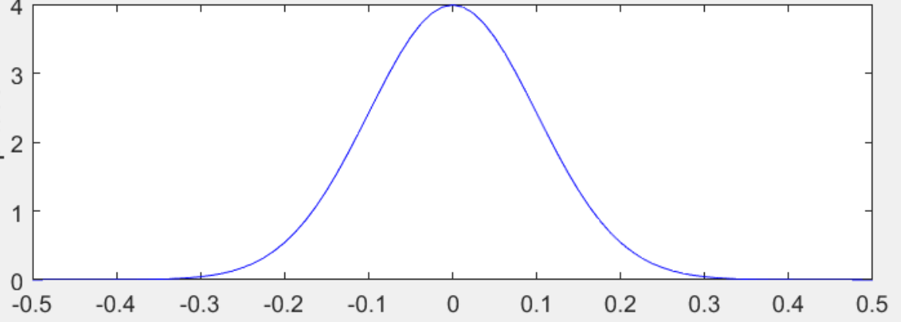
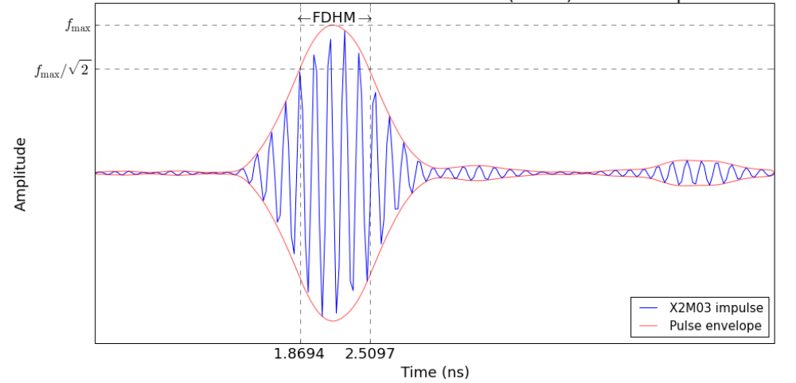

# 信号建模

高斯脉冲：

$$g(t) = V_{tx}exp(-2\pi ^2f_B^2log_{10}(e)t^2)$$

发射信号：

$$x(t) = g(t)cos(2\pi f_c t)$$

对于一个反射点的信道响应：

$$h_p(t) = \alpha_p \delta(t-T_p)$$

$$T_p = \frac{2R_p}{c} = \frac{2\sqrt{x_p^2+y_p^2+z_p^2}}{2}$$

整个物体的信道响应：

$$h(t) = \int_{p\in P} \alpha(x_p,y_p,z_p)\delta(t-\frac{2R_p}{c}) \,dp$$

收到的反射信号：
$$
\begin{align*}
y(t) &= x(t)*h(t)+n(t)  \\
     &= \int_{p\in P} \alpha(x_p,y_p,z_p)g(t-\frac{2\sqrt{x_p^2+y_p^2+z_p^2}}{c})cos(2\pi f_c(t-\frac{2\sqrt{x_p^2+y_p^2+z_p^2}}{c})) \,dp + n(t)\\
     &= \int_{p\in P} \alpha(x_p,y_p,z_p)g(t-\frac{2R_p}{c})cos(2\pi f_c(t-\frac{2R_p}{c})) \,dp + n(t)
\end{align*}
$$
